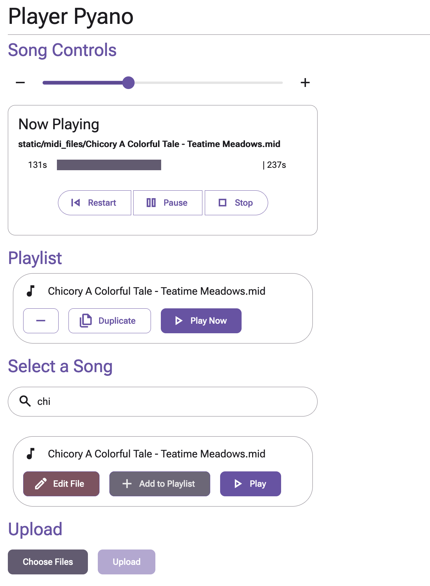

# About
This is a Flask app which allows a user to play a midi file. This is meant for use with a Yamaha Disklavier where the idea is that it can run on a Raspberry Pi and be controlled on the local network.



# Installation and Development
First, install [miniforge](https://github.com/conda-forge/miniforge) after which you can create a conda environment and install the Python dependencies with 
```
make install
```

Building and developing the frontend depends on node. We would recommend using [nvm](https://github.com/nvm-sh/nvm) to manage your node and npm versions. Once you have that,`cd frontend` and run `npm install`. You can then run `make build` which will build the frontend and copy the files into the flask app.

You can then run the app with `make start` and view your app at [localhost:5000](http://localhost:5000).

If you're actively developing the frontend we recommend `make start-frontend`, which will serve the frontend and the backend at the devault Svelte port [localhost:5173](http://localhost:5173). This will also watch for changes to the frontend and rebuild it automatically.


